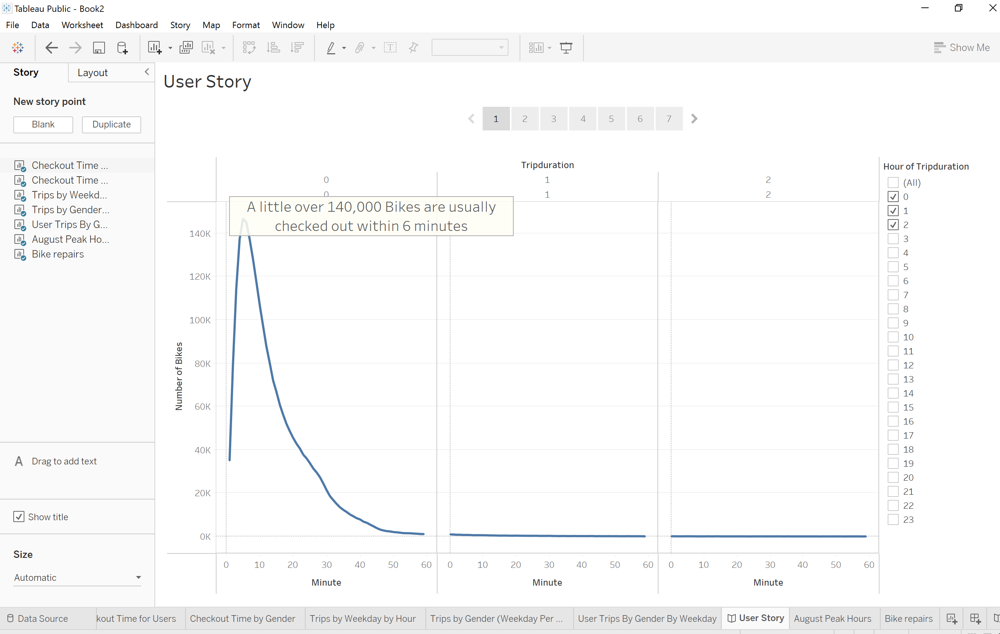
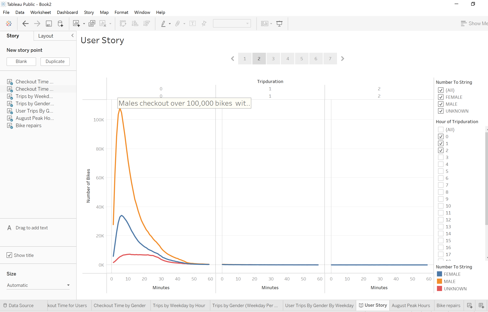
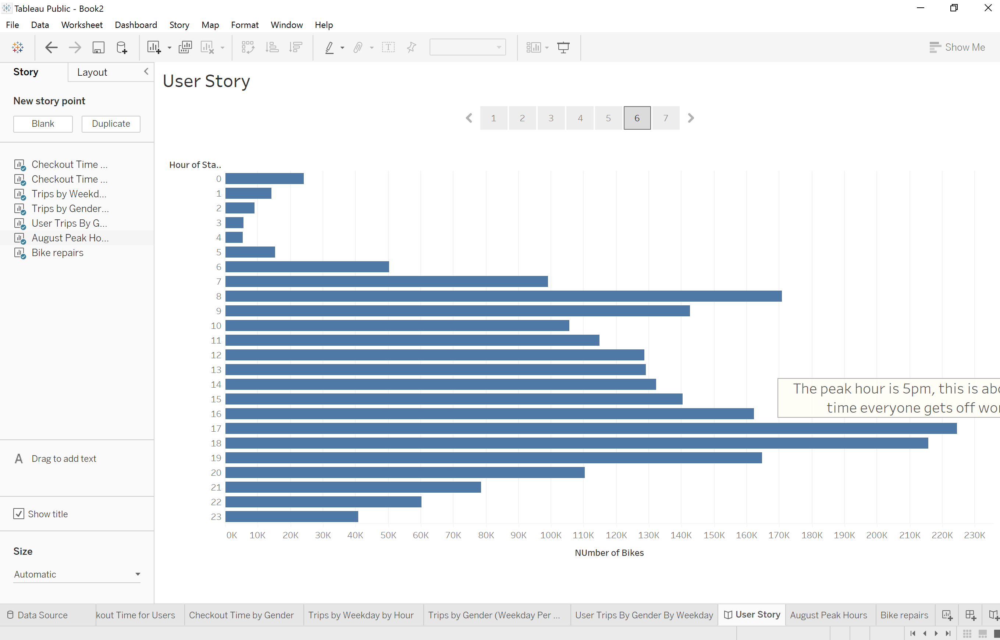
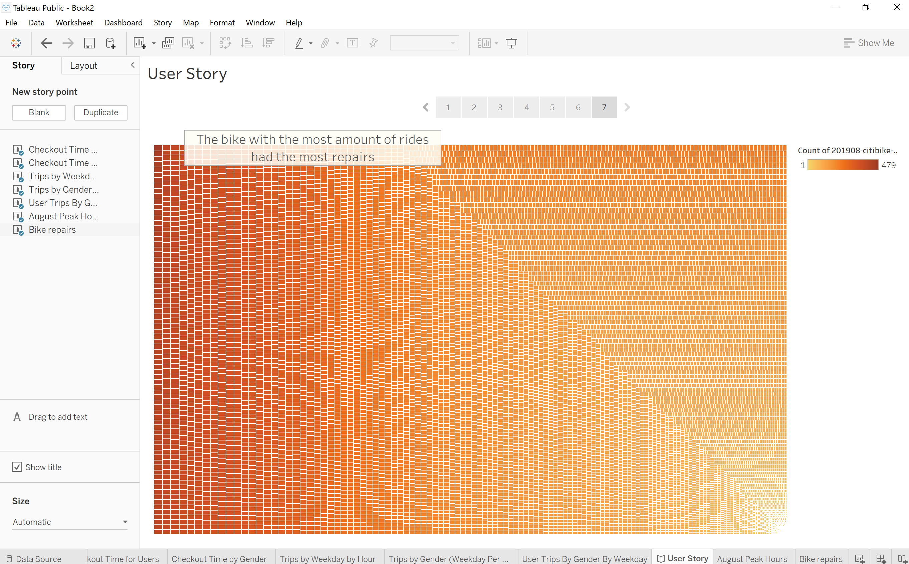
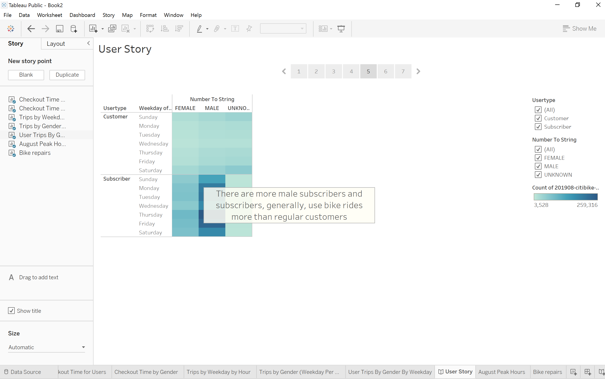
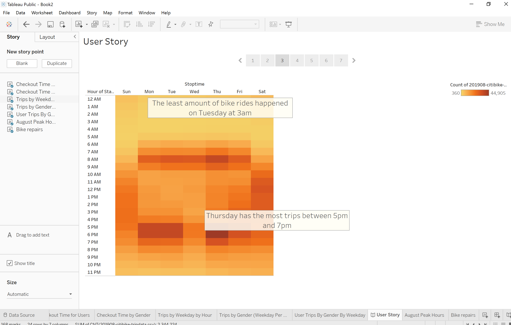
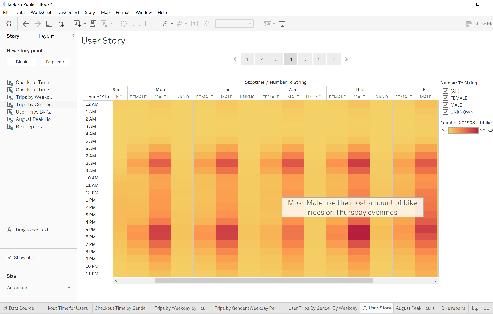

# BIKE_SHARING

# Overview of the analysis

The purpose of this analysis was to create powerful analytic dashboards that tells a clear story of bike ride in New York.

## Results

This is length of time that bikes are checked out for all riders 

This is length of time that bikes are checked out for all riders by genders

This is the different checkout times for riders and the peak checkout time is at 5pm

The bikes with more rides have the most amount of repair

The number of bike trips for each type of user, which shows that more subscribers use the bike than regular customers

The number of bike trips for all riders and genders for each hour of each day of the week

The number of bike trips for each type of user and gender for each day of the week

## Summary

The dataset showed the total number of rides, the different types of users (subscribers and customers), the peak periods which can be used to determine the best time to have the bikes repaired. The bikes that requires the least repairs can be substituted for bike sharing during repairs. More males use the bikes than females and other gender types. ALso, more males use the bikes mostly on Thursday evenings.

I can create a visualization that shows:

a. the gender of the 2 user types

b. the different checkout times for the 2 user types and the peak checkout time
